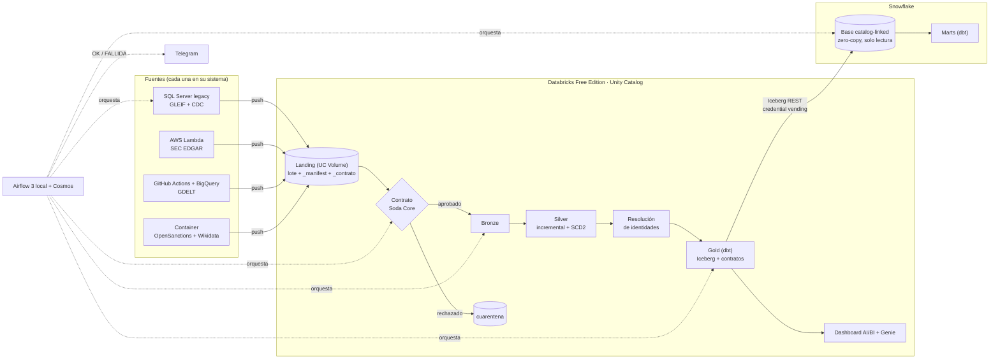

# entity360-multicloud-databricks

**La misma empresa aparece en 5 fuentes, traídas por 4 productores, con nombres e identificadores distintos. Esta plataforma la
convierte en un solo golden record explicable: cada atributo dice de qué fuente vino y cada unión dice por
qué se hizo.**

Sexto proyecto del portfolio de Data Engineering de Gastón. Código, documentación y commits en español.

## El problema
Una organización tiene sus datos repartidos entre un ERP legacy on-prem y varias nubes. Acá las entidades
son **empresas reales** y las fuentes son **registros públicos reales** que se pisan entre sí.
**4 productores · 5 fuentes:**

| Sistema | Fuente | Aporta | Identificador |
|---|---|---|---|
| SQL Server on-prem, con CDC | GLEIF | Entidades legales, direcciones, matriz/filial | LEI |
| AWS (EventBridge → Lambda → S3) | SEC EDGAR | Emisores que cotizan en EE. UU. | CIK |
| GCP (BigQuery desde GitHub Actions) | GDELT | Menciones en noticias, con tono | solo un nombre |
| Container (GHCR) | OpenSanctions + Wikidata | Sanciones, PEP; puente de identificadores | a veces LEI / QID |

Ninguna comparte un identificador con todas las demás. **1.268 registros → 1.136 entidades.**

## Arquitectura

Cada productor guarda primero en su propio almacenamiento y después **empuja** el lote al landing con un
manifest (sha256, registros, rango extraído). Airflow espera los manifests, corre los contratos, dispara el
job de Databricks, construye Gold con dbt, refresca Snowflake, corre los marts y avisa por Telegram.

## Qué demuestra
- **Resolución de identidades medida, no afirmada.** Set de validación etiquetado a mano (59 registros + 60
  pares), intervalos de Wilson al 95 %. v1 con **medición ciega**: P 0,913 [0,732–0,976], R 0,955
  [0,782–0,992]. v2.1 en el set completo (no ciega): P 1,000 [0,921–1,000], R 0,978 [0,887–0,996]
  ([informe](databricks/resolucion/calibracion/INFORME.md), [ADR 0010](docs/adr/0010-resolucion-por-reglas-calibrada.md)).
- **Silver incremental: 423 s → 32 s** sin lotes nuevos, con huellas idénticas en las 12 tablas contra el
  recálculo completo ([validación](databricks/evidencia/silver-incremental-validacion.md)).
- **DAG de punta a punta: 28/28 tareas en ~11–13 min** (12 min 44 s la corrida programada; 11 min la manual
  con aviso por Telegram) ([corrida](airflow/evidencia/corrida-2026-10-01.md)).
- **Snowflake zero-copy por 0,07 créditos**: lee Gold vía Iceberg REST sin copiar datos; las 4 tareas de
  Snowflake suman 53 s por corrida ([consumo](snowflake/evidencia/consumo.md)).
- **0 secretos en un state de Terraform**: los de los SP viven en el llavero o en el secret manager de cada
  nube; la integración con Snowflake va por script por eso ([ADR 0012](docs/adr/0012-integracion-snowflake-fuera-de-terraform.md)).
- **Mínimo privilegio probado, no declarado**: el SP de Snowflake recibe **403** en `silver`
  ([vending](snowflake/evidencia/vending-sp.txt)); la base catalog-linked rechaza escribir incluso a
  ACCOUNTADMIN (`allowed write operations: 'NONE'`, [evidencia](snowflake/evidencia/catalog-linked.txt)).
  Un SP por productor ([ADR 0002](docs/adr/0002-un-sp-por-productor.md)).
- **Contratos en la llegada**: un lote roto va a cuarentena antes de Bronze, con alerta
  ([prueba](contracts/evidencia/cuarentena-punta-a-punta.txt), [ADR 0006](docs/adr/0006-bronze-exige-contrato.md)).
- **Todo con Terraform** (AWS, GCP, Databricks, Snowflake) y más de 200 tests locales (medallion, contratos,
  Airflow, Snowflake, productores).

## Decisiones y lo que aprendí
- **Latido ≠ frescura.** Un productor sin novedades no dejaba nada y el sensor lo daba por caído. Ahora deja
  un `_manifest` vacío (`sin_cambios: true`) que conserva el estado: "estoy vivo" se separa de "hay datos
  nuevos" ([ADR 0014](docs/adr/0014-latido-separado-de-frescura.md), [corrida sin bypass](airflow/evidencia/corrida-2026-10-01.md)).
- **Identidad estable de Gold.** `CREATE OR REPLACE` cambia el UUID de la tabla y rompe lo que Snowflake
  tenía vinculado. Gold pasó a `incremental` con `insert_overwrite`: misma tabla, mismo `table_id`
  ([`dbt_project.yml`](dbt/dbt_project.yml), [estado](docs/estado.md), Próximos pasos 3).
- **Ownership de Gold.** Un `dbt build` local dejó Gold a nombre del usuario y el DAG falló con
  `PERMISSION_DENIED`. dbt devuelve cada tabla al SP del orquestador al terminar
  ([ADR 0007](docs/adr/0007-principal-de-airflow.md), [macro](dbt/macros/duenio_gold.sql)).
- **Roles secundarios que enmascaraban permisos.** Los conteos "con el rol de dbt" pasaban por ACCOUNTADMIN
  como rol secundario. Repetidos con `USE SECONDARY ROLES NONE` probaron los grants de verdad
  ([evidencia](snowflake/evidencia/marts-dbt.txt)).
- **Un token impreso por un bug.** Un paso de la validación devolvía el token OAuth del SP y el runner lo
  imprimía. Ahora los pasos devuelven descripciones y la salida enmascara secreto y token, con tests que
  fallan con la versión vieja; se verificó que nunca entró a un commit
  ([script](snowflake/validar_vending.py), [tests](tests/snowflake/test_validar_vending.py)).
- **La cuota limita el desarrollo, no la operación.** La cuota diaria serverless de Free Edition se agotó un
  día de mucho desarrollo; la corrida diaria entra holgada. Respuesta: Silver incremental y agrupar el
  trabajo que usa el warehouse ([ADR 0011](docs/adr/0011-silver-incremental-y-cuota.md)).
- **Push en vez de pull** al landing: cada sistema puede atrasarse sin frenar a los demás
  ([ADR 0009](docs/adr/0009-productores-empujan-al-landing.md)).
- **Lo dudoso no se fuerza.** Banco Galicia (solo nombre en GDELT, sin LEI ni CIK) queda en
  `resolution.revision`: unirla exigía suponer el país, la misma suposición que en v1 unía una matriz
  mexicana con su filial argentina ([informe](databricks/resolucion/calibracion/INFORME.md)).

Todas las decisiones: [docs/adr/](docs/adr/) (0001–0014).

## Stack por capa
| Capa | Tecnología |
|---|---|
| Fuentes | SQL Server 2022 + CDC (Docker), AWS Lambda/S3/EventBridge, BigQuery sandbox + GitHub Actions (WIF), container en GHCR |
| Llegada | UC Volume, manifest por lote, contratos con Soda Core 4 |
| Procesamiento | Databricks Free Edition, job PySpark (Bronze → Silver SCD2 → resolución), Unity Catalog |
| Modelado | dbt (Gold en Iceberg gestionado con contratos; marts en Snowflake) |
| Warehouse | Snowflake (catalog-linked database sobre Iceberg REST) |
| Orquestación y avisos | Airflow 3.3 local + Astronomer Cosmos; Telegram |
| Consumo | Dashboard AI/BI "Entity 360", Genie |
| Infraestructura | Terraform (AWS, GCP, Databricks, Snowflake) |

## Estructura del repo
| Carpeta | Qué hay |
|---|---|
| `producers/` | Los 4 productores (CDC, SEC EDGAR, GDELT, enriquecimiento), cada uno con su README |
| `legacy/` | SQL Server con el ERP de GLEIF y CDC |
| `contracts/` | Contratos de Soda por fuente y alertas |
| `databricks/` | Medallion, resolución, validación, consumo (dashboard y Genie) y evidencia |
| `dbt/` | Gold (Databricks) y marts (Snowflake) |
| `snowflake/` | Cuenta, integración catalog-linked, validación del vending y evidencia |
| `airflow/` | DAG `entity360_convergencia`, imagen, scripts de levantar/apagar y evidencia |
| `infra/` | Terraform por nube |
| `spike/` | La validación previa de todo lo dudoso ([informe](spike/INFORME.md), decisiones D1–D12) |
| `docs/` | ADRs, [estado](docs/estado.md), [fuentes y licencias](docs/fuentes.md), pasos manuales y destroy |
| `tests/` | Tests locales, sin nube |

## Cómo reproducirlo
Windows 11 + PowerShell, Docker Desktop, Terraform y las CLI de Databricks, AWS, gcloud y `gh`. Los valores
identificatorios van en archivos ignorados (`terraform.tfvars`, `.env`) a partir de sus `.example`; el repo
usa placeholders (`<WORKSPACE_URL>`, `<AWS_ACCOUNT_ID>`, `<ORG>-<CUENTA>`).

1. Pasos manuales y orden completo: **[docs/manual-steps.md](docs/manual-steps.md)** (credenciales, alertas
   de presupuesto, Terraform por nube, productores, dbt, Airflow, Snowflake, Telegram).
2. Para bajarlo todo: **[docs/destroy.md](docs/destroy.md)**.

## Costos
Septiembre de 2026, el mes en que se construyó todo. Octubre está en curso y no se incluye.

| Plataforma | Costo | Detalle |
|---|---|---|
| AWS | **USD 0,20** | Cost Explorer, `UnblendedCost` sin créditos: S3 0,124, Secrets Manager 0,066, Cost Explorer 0,010 (las propias consultas); Lambda, SNS, SQS, CloudWatch, Glue y KMS en 0. Presupuestos de 50 y 100 USD como alarma |
| GCP | **USD 0** | Sandbox de BigQuery, sin cuenta de facturación ([ADR 0003](docs/adr/0003-gcp-sin-facturacion.md)) |
| Databricks | **USD 0** | Free Edition. El límite es la cuota diaria serverless; una corrida usa 0,6–1,2 DBU ([evidencia](databricks/evidencia/pasos1-3-primeras-corridas.txt)) |
| Snowflake | **~0,07 créditos** del trial | Trial Enterprise; acumulado hasta la primera corrida del DAG con Snowflake. Resource monitors de 20 y 25 créditos como techo ([consumo](snowflake/evidencia/consumo.md)) |
| Airflow, SQL Server | **USD 0** | Locales, en Docker ([consumo de la PC](airflow/evidencia/consumo.md)) |

## Capturas
Van en `docs/img/` con estos nombres:

| Archivo | Qué muestra |
|---|---|
| `entity360.gif` | Recorrido: buscar una empresa en el dashboard y ver su golden record |
| `dashboard-empresa.png` | Página "empresa": golden record con procedencia por atributo |
| `dashboard-salud.png` | Página "salud de la plataforma": frescura, cuarentenas, tests, P/R |
| `genie-pregunta.png` | Genie respondiendo una pregunta en español, con su SQL |
| `airflow-dag-verde.png` | Vista de grafo del DAG con las 28 tareas en verde |
| `unity-catalog-gold.png` | Linaje o esquema de `entity360.gold` en Unity Catalog |
| `snowflake-catalog-linked.png` | `ENTITY360_UC` en Snowsight con las 5 tablas de Gold |
| `telegram-aviso.png` | Mensaje "entity360: corrida OK" |
| `revision-resolucion.png` | `resolution.revision` con la contribución de cada señal |

## Licencias y atribución
Datos: GLEIF (CC0), SEC EDGAR (dominio público), Wikidata (CC0), OpenSanctions (**CC BY-NC 4.0**, uso no
comercial) y The GDELT Project (https://www.gdeltproject.org/). Detalle en [docs/fuentes.md](docs/fuentes.md).
