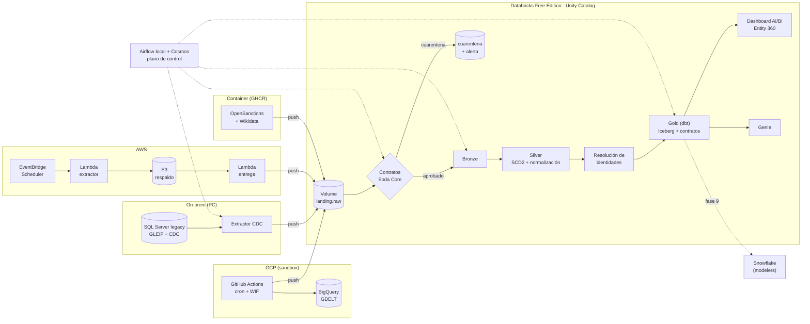

# entity360-multicloud-databricks

**La misma empresa aparece en cinco sistemas, con cinco nombres y ningún identificador en común. Esta
plataforma la convierte en una sola fila confiable, gobernada y lista para preguntarle en español.**

Sexto y último proyecto del portfolio de Data Engineering de Gastón. Todo el desarrollo, la
documentación y los commits están en español.

## El problema
Una organización tiene sus datos repartidos en un sistema legacy on-premise y en varias nubes. La misma
entidad aparece en diez sistemas, con nombres e identificadores distintos, duplicada y sucia. Necesita
en dos meses una base confiable para que modelen los analistas y, en seis, poder ponerle agentes encima.
Además quiere señales casi en tiempo real para marketing y riesgo.

Acá las entidades son **empresas reales** y las fuentes son **registros públicos reales** que se pisan
entre sí. El desorden no se inventó: ya existe.

| Fuente | Dónde vive (el "sistema") | Qué aporta | Identificador |
|---|---|---|---|
| **GLEIF** | SQL Server on-prem (el ERP legacy), con CDC | Entidades legales, direcciones, relaciones matriz/filial | LEI |
| **SEC EDGAR** | AWS (Lambda + S3) | Emisores que cotizan en EE. UU., nombres anteriores | CIK |
| **GDELT** | GCP (BigQuery, sin facturación) | Menciones en noticias, con tono | un nombre |
| **OpenSanctions** | Container de enriquecimiento | Sanciones, PEP, listas de riesgo | a veces un LEI |
| **Wikidata** | Container de enriquecimiento | Puente de identificadores (LEI, CIK, ticker) | QID |

Ninguna comparte un identificador con todas las demás: por eso hace falta **resolver identidades**, y
esa es la parte central del proyecto. Universo: empresas argentinas con LEI, las argentinas que cotizan
en EE. UU. y un conjunto de control de otros países. **1.268 registros de cinco fuentes → 1.136
entidades.**

## La arquitectura

Cada productor escribe primero en su propio almacenamiento y después **empuja** el lote al landing con
un manifest (sha256, registros, extracción). Airflow espera los manifests, corre los contratos, dispara
el job de Databricks (Bronze → Silver → resolución), construye Gold con dbt y mide la frescura.

## El porqué de cada pieza
| Pieza | Por qué está |
|---|---|
| **SQL Server + CDC** | Es el legacy on-prem: el patrón más pedido es sacar cambios de una base transaccional sin romperla. Cargar GLEIF real en un SQL Server es una decisión de arquitectura, no de datos (`legacy/README.md`). |
| **AWS** (EventBridge → Lambda → S3 → Lambda) | Otro sistema de la organización: extracción programada de la SEC, con respaldo propio, DLQ y alarma. |
| **GCP** (BigQuery desde GitHub Actions) | GDELT vive como dataset público en BigQuery. Sin facturación en GCP: consultas en sandbox con guardarraíles de bytes (ADR 0003). |
| **Container de enriquecimiento** | OpenSanctions y Wikidata no son de ninguna nube: una imagen que corre igual en cualquier lado. |
| **Push a un UC Volume** | Free Edition no sale a buscar datos de forma confiable; cada sistema puede atrasarse sin frenar a los demás (ADR 0009). |
| **Databricks** | Convergencia, Spark, resolución de identidades, gobierno con Unity Catalog, dashboard y Genie. Un job de PySpark explícito (ADR 0004). |
| **Soda Core** | Contratos en la llegada: un lote roto va a cuarentena antes de Bronze (ADR 0006). |
| **dbt** | Gold con contratos enforced en Iceberg gestionado (ADR 0005): el modelo que ven los analistas. |
| **Iceberg** | Formato abierto para que Snowflake lea Gold sin copiarlo (Camino A del spike). |
| **Airflow** | Orquesta lo que vive fuera de Databricks (el CDC en la PC, los contratos, dbt). Si todo estuviera adentro, alcanzarían los Jobs. Local por costo, con su propio SP (ADR 0007). |
| **Snowflake** (fase 9, pendiente) | El warehouse de los modelers: el caso real de "empresa con dos plataformas". |
| **Terraform** | Todo lo que lo soporta; lo demás, en `docs/manual-steps.md`. |

## La historia
| Fase | Qué se hizo | Dónde |
|---|---|---|
| 0 · Spike | Se validó todo lo dudoso antes de construir: push a un volume, Iceberg legible desde afuera, cobertura real de cada fuente. 12 decisiones (D1–D12). | `spike/INFORME.md` |
| 1 · Base | Catálogo, schemas y volume en Unity Catalog sobre S3 propio, grants por rol. | `infra/databricks`, `infra/aws` |
| 2 · Legacy | SQL Server con el ERP de GLEIF (1.162 entidades) y CDC en cuatro tablas. | `legacy/` |
| 3 · SEC EDGAR | 16 emisores argentinos, diario, con DLQ y alarma. | `producers/aws_sec_edgar` |
| 4 · GDELT | Menciones cada hora, ventana de 24 h porque el cron de Actions saltea horas. | `producers/gcp_gdelt` |
| 5 · Enriquecimiento | OpenSanctions (2.597 entidades) y Wikidata, diario. | `producers/container_enrichment` |
| 6 · Medallion | Bronze con idempotencia en tres capas, Silver con SCD2, resolución de identidades calibrada. | `databricks/` |
| 7 · Contratos y Gold | Soda en la llegada, dbt con 5 modelos y 19 tests. | `contracts/`, `dbt/` |
| 8 · Airflow | DAG de convergencia con Cosmos; stack liviano después de saturar la PC. | `airflow/` |
| 9 · Snowflake | **Pendiente** (abre un trial de 30 días). | `reglas/11` |
| 10 · Consumo | Dashboard "Entity 360", Genie y panel de salud de la plataforma. | `databricks/consumo/` |

## Calidad de la resolución de identidades
Medida contra un **set de validación curado a mano** (D11): 59 registros y 60 pares etiquetados con
evidencia, partidos por estrato en calibración (62 unidades) y evaluación (57). Intervalos de Wilson al
95 %: con tan pocos casos son anchos, y se publican así.

| Versión | Qué cambió | Partición | VP / FP / FN | Precisión [IC 95 %] | Recall [IC 95 %] |
|---|---|---|---|---|---|
| **v1** | Reglas iniciales, **medición ciega** | evaluación | 21 / 2 / 1 | 0,913 [0,732–0,976] | 0,955 [0,782–0,992] |
| v1 | | set completo | 43 / 4 / 3 | 0,915 [0,801–0,966] | 0,935 [0,825–0,978] |
| **v2.1** | 4 correcciones de la calibración + token único raro por idf + país heredado en GDELT, **no ciega** | evaluación | 22 / 0 / 0 | 1,000 [0,851–1,000] | 1,000 [0,851–1,000] |
| v2.1 | | set completo | 45 / 0 / 1 | 1,000 [0,921–1,000] | 0,978 [0,887–0,996] |

La v1 es el número honesto: nadie miró sus errores antes de medir. La v2.1 salió de mirar los errores
del set completo, así que su evaluación no es ciega. Recall del blocking: 22/22. Cada par guarda la
contribución de cada señal; lo dudoso no se fuerza y queda en `resolution.revision` (20 a revisar, 11
conflictos, 8 empates). Detalle: `databricks/resolucion/calibracion/INFORME.md` y ADR 0010.

## Consumo
- **Dashboard AI/BI "Entity 360"** (Terraform): buscador de empresa → golden record con la procedencia
  de cada atributo, fuentes, duplicados resueltos, historial del CDC, noticias (GDELT) y riesgo
  (OpenSanctions); un panorama general; y un **panel de salud** con frescura, latencia de punta a punta,
  volumen, cuarentenas, tests de dbt y calidad de la resolución.
- **Genie "Entity 360"** sobre Gold, con instrucciones, joins, ejemplos de SQL y las descripciones de
  columnas de dbt. Probado con 5 preguntas reales: 5/5 correctas, después de documentar el JSON del CDC
  (la primera vez falló una). El SQL de cada respuesta está en `databricks/consumo/genie/`.

El mensaje del cierre: la data curada, gobernada y documentada ya vive en la nube. Ponerle un agente
encima es el último paso, y el más fácil.

## Errores conocidos

### Banco Galicia queda en revisión (resolución de identidades, A059)
La clave `BANCO_GALICIA` del diccionario de alias de GDELT (Banco de Galicia y Buenos Aires, la
subsidiaria de Grupo Financiero Galicia, que no presenta ante la SEC) no trae CIK ni LEI. Sin un
identificador compartido no hereda país (la resolución nunca supone uno) y suma 60 puntos contra el
Banco de Galicia y Buenos Aires de GLEIF: queda en `resolution.revision` (tipo `revisar`). En Gold hay
dos entidades para el mismo banco: la de GLEIF (con su LEI anulado fusionado) y una que solo tiene la
clave de GDELT, y las menciones en noticias (`fct_news_signal`) quedan en la segunda.

Es una decisión, no un descuido: unirla exigía suponer el país AR, y esa suposición es la que unía la
matriz mexicana de Vista con su filial argentina (calibración v1). Bajar el umbral de aceptación a 60 la
resolvería, pero aceptaría también todos los pares que hoy esperan revisión con 60 puntos. Detalle y
números: `databricks/resolucion/calibracion/INFORME.md` (v2.1). Solución prevista: resolverla a mano en
la revisión, o agregar el LEI al diccionario como dato del productor (fase 4), no del matching.

### Otros casos resueltos que vale la pena contar
- **Gold a nombre de quien corrió dbt.** Un `dbt build` desde la PC dejó Gold a nombre del usuario y dbt
  en Airflow falló con `PERMISSION_DENIED`. Ahora dbt pasa cada tabla al SP del orquestador al terminar
  (ADR 0007, actualización).
- **Un DAG en verde con dbt caído.** La única hoja del DAG corría con `all_done`. Ahora una tarea final
  hace fallar la corrida.
- **El cron de GitHub Actions saltea horas** (3 corridas en 20 h): la ventana de GDELT pasó a 24 h para
  no perder menciones (ADR 0003).

## Limitaciones (y cómo se resolvieron)
| Limitación | Qué se hizo |
|---|---|
| **Cuota diaria de cómputo serverless de Free Edition.** Cuando se agota, el warehouse no arranca y no corre nada (pasó el 2026-09-29). | Silver incremental: solo procesa los lotes nuevos de Bronze (ADR 0011). El trabajo que usa el warehouse se agrupa. |
| Free Edition no crea catálogos sobre default storage por API. | Catálogo sobre S3 propio, por Terraform (D1, D8). |
| Salida a internet restringida según la documentación. | Modelo push a un volume (ADR 0009, D9). |
| Un solo SQL warehouse; sin grupos de cuenta. | Consumo por principal dedicado (ADR 0001); un SP por productor (ADR 0002). |
| Iceberg gestionado no acepta append en streaming ni `PRIMARY KEY`/`CHECK`. | Todo se escribe con MERGE; unicidad y rangos como tests de dbt (ADR 0004, 0005). |
| Genie no tiene recurso de Terraform. | Script idempotente desde un JSON versionado (ADR 0008). |
| GCP sin facturación. | BigQuery sandbox desde GitHub Actions, con tope de bytes por consulta (ADR 0003, D12). |
| Airflow local en una PC personal: la primera corrida saturó la CPU. | Stack liviano (4 tareas a la vez, techo por container) y techo de WSL2 (`airflow/evidencia/consumo.md`). |
| Snowflake todavía no está. | Fase 9, pendiente de OK (abre un trial de 30 días). |

## Cómo levantarlo
Windows 11 + PowerShell, Docker Desktop, Terraform, Databricks CLI, AWS CLI (perfil `tesseract`), gcloud y
`gh`. Los valores identificatorios van en archivos ignorados por git (`terraform.tfvars`, `.env`) a partir
de sus `.example`; el repo usa placeholders (`<WORKSPACE_URL>`, `<AWS_ACCOUNT_ID>`, ...).

1. **Credenciales y pasos previos:** `docs/manual-steps.md` §1–3b (perfil de Databricks, AWS, variables,
   GCP) y las alertas de presupuesto de AWS antes de crear nada.
2. **Base:** `terraform apply` en `infra/aws` y después en `infra/databricks` (catálogo, schemas, volume,
   SP, job, dashboard). Pasos manuales de Databricks: §4–5.
3. **Legacy:** `docker compose -f legacy\docker-compose.yml up -d` y la carga de GLEIF
   (`legacy/README.md`); credenciales del extractor CDC (§6).
4. **Productores:** `infra/aws/sec_edgar` (§7), el container de enriquecimiento (§8) y GDELT con
   `infra/gcp` (§9). Cada uno tiene su README en `producers/`.
5. **Contratos y dbt:** entornos de `contracts/` y `dbt/` (§10–11, `dbt/README.md`).
6. **Airflow:** `.\airflow\levantar.ps1` (§12, `airflow/README.md`). El DAG `entity360_convergencia` corre
   a las 08:45 (Buenos Aires).
7. **Consumo:** `python databricks\consumo\genie.py desplegar`; el dashboard ya lo creó el paso 2.

Para bajarlo todo: `docs/destroy.md`.

## Dónde está cada cosa
| | |
|---|---|
| `docs/estado.md` | Dónde está el proyecto hoy y qué falta |
| `docs/adr/` | Decisiones de arquitectura (0001–0012) |
| `docs/fuentes.md` | Fuentes, licencias y atribuciones |
| `docs/manual-steps.md`, `docs/destroy.md` | Lo que no es Terraform, y cómo bajar todo |
| `reglas/` | Las reglas del proyecto, una por fase |
| `spike/INFORME.md` | El spike y las decisiones D1–D12 |

## Licencias y atribución
Datos: GLEIF (CC0), SEC EDGAR (dominio público), Wikidata (CC0), OpenSanctions (opensanctions.org,
**CC BY-NC 4.0**, uso no comercial) y The GDELT Project (https://www.gdeltproject.org/). Detalle en
`docs/fuentes.md`.
